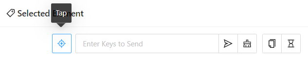
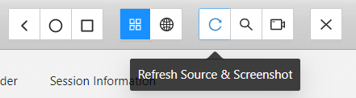
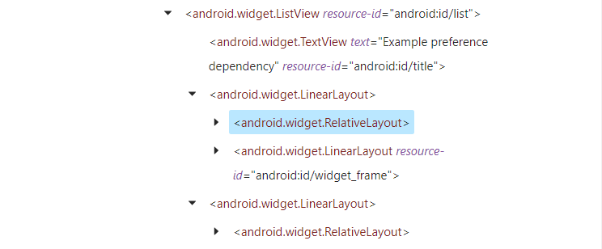
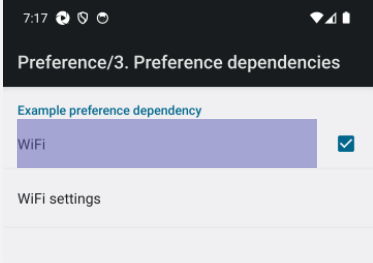
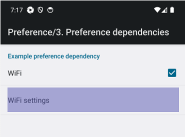
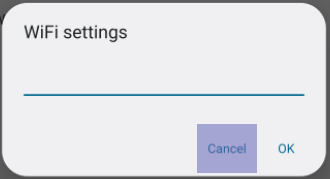
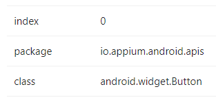
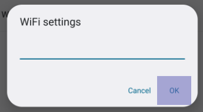
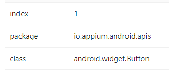

# SHORTCUTS

Win + Ctrl + Right	-	Move to following desktop

Win + Ctrl + Left	-	Move to previous desktop


RTR	-	Ready To Run


# TROUBLESHOOTING

"Call to 'tap' fail" error in inspector emerges when a test has been run in eclipse. The solution is to close and exit the inspector session and open it again.


# BROWSE AN APP IN INSPECTOR

> OPTION A: STRAIGHTFORWARD FROM INSPECTOR

We've seen the three main sections of an Inspector session: **preview (or screenshot)**, **app source**, and **selected element**.

In preview, we can touch any element we want and see its properties in selected element. And there, we also have some actions available, **namely**:

- Tap (it's a click on the item)
- Send keys
- Copy attributes to clipboard
- Get timing




> OPTION B: FROM ANDROID STUDIO

A second way is to browse the app in Android Studio and go to the page we want, then, come back to Inspector and select **'Refresh source and screenshot'** option, from the options bar at the top.




# LOCATORS

### Quick note about Xpath

It's **NOT recommended** to use Xpath.

Xpath can lead to test failures if:

- there are changes in the app structure.
- xpath is based on an element that dissapears.

**id and accessibilityID are better options**.

### Common Xpath syntax

An Xpath is made using this structure: `//tagName[@attribute='value']`, whereas its actual properties are defined in <u>XML</u> code.

This implies that **we can make the Xpath by ourselves just by looking at the XML description of the element** and following the syntax above (in the case the Xpath wasn't recognized by Inspector).

### Correct use of By.xpath()

> NO BACKSLASHES

When copying an Xpath, we must ensure that it **doesn't contain backslashes** `\`. When they contain backslashes, we must remove them, like in this example: 

- This is wrong ❎ `//android.widget.TextView[@content-desc=\'3. Preference dependencies\']`

- This is correct ✅ `//android.widget.TextView[@content-desc='3. Preference dependencies']`


> NO DOUBLE QUOTES

Also, it **shouldn't have double quotes** `""`. If it has, we must change them for single quotes `''`, like in this example:

* This is wrong ❎ `//android.widget.TextView[@content-desc="3. Preference dependencies"]`.

- This is correct ✅`//android.widget.TextView[@content-desc='3. Preference dependencies']`.

This needs to be done because, when pasted as an argument of By.xpath(), the string will be enclosed between double quotes.


### Use of App Source as locator with index (By.xpath)

Assume the scenario in which our element doesn't have an id and the xpath is large and complicated.

We can create our Xpath by **examining the 'App Source'** section and **clicking on the lines** of code **to see** its actual **hightlighting** in the preview section.

For example:

1. This line here:

   

   points to this item:

   

2. and this line here:

   

   points to this item:

   

In this case, we notice that they have the same names (`<android.widget.Relative.Layout>`), but the one that we want to click is the second, the one that appears later/below.

So, we can create our Xpath by following the syntax described above:

```java
"//android.widget.RelativeLayout"
```

and then enclose it between parenthesis `()` and add the index with `[]`:

```java
"(//android.widget.RelativeLayout)[2]"
```

to make:

```java
myDriver.findElement(By.xpath("(//android.widget.RelativeLayout)[2]")).click();
```

This tells the driver to **find and click** the second element it finds with that Xpath (**the 2nd matching item**).


### Use of Attributes as locator with index (By.classname)

Similarly, we can identify the **classname and index** of a certain element in the **Attributes table** at the right of Inspector.

- Item 1





- Item 2





##### .findElements()

Up until now, we've used `.findElement()` method, but, if we want to search for all matching elements and then choose an index and click on it, we need to use `.findElements` (in plural), with this syntax:

```java
myDriver.findElements(AppiumBy.className("android.widget.Button")).get(1).click();
```

An alternative is to create a variable (myButton) to store a list of web elements (List<WebElement>), then get the index and click on it.

```java
List<WebElement> myButton = myDriver.findElements(By.className("android.widget.Button"));
buttons.get(1).click();
```


# MOBILE POPUPS

### Send keys

Syntax:

```java
myDriver.findElement(By.id("android:id/edit")).sendKeys("Alex WIFI");
```


# TIMEOUT

### Implicit wait

Waits a specific time for an item (or page) to load, if it loads within the specified time, the test continues.

> GLOBAL TIMEOUT

It goes in <u>BaseTest//@BeforeClass</u>, under our android object.

```java
myDriver.manage().timeouts().implicitlyWait(Duration.ofSeconds(10));
```

This is its place inside BaseTest:

```java
        // Android object and app (session) startup
		myDriver = new AndroidDriver(new URL("http://127.0.0.1:4723"), myOptions);
		myDriver.manage().timeouts().implicitlyWait(Duration.ofSeconds(10));
```

It means that there's a wait of 10 secs for each element to be found in order to continue the test.


### Test 1 (RTR)

STEPS

1. Open API Demos (myDemo.apk)
2. Tap on 'Preferences'
3. Tap on '3. Preference dependencies'
4. Mark the WIFI checkbox
5. Tap on the new-available-option 'WiFi settings'
6. Type 'Alex WIFI' inside the text popup
7. Tap on 'OK'
8. Set a global implicit-wait-timeout of 10 secs

**Automation:**

```java
package alex.appium.project0;

import org.openqa.selenium.By;
import org.testng.annotations.Test;
import java.net.MalformedURLException;
import io.appium.java_client.AppiumBy;


public class appiumBasics extends BaseTest{
	@Test
	public void myWifiSettingsTest() throws MalformedURLException {
        // Automation goes here...
		myDriver.findElement(AppiumBy.accessibilityId("Preference")).click();
		myDriver.findElement(By.xpath("//android.widget.TextView[@content-desc='3. Preference dependencies']")).click();
        myDriver.findElement(By.id("android:id/checkbox")).click();
        myDriver.findElement(By.xpath("(//android.widget.RelativeLayout)[2]")).click();
        myDriver.findElement(By.id("android:id/edit")).sendKeys("Alex WIFI");
        myDriver.findElements(AppiumBy.className("android.widget.Button")).get(1).click();
        
	}
}
```

**BaseTest:**

```java
package alex.appium.project0;

import java.io.File;
import java.net.MalformedURLException;
import java.net.URL;
import java.time.Duration;

import io.appium.java_client.android.AndroidDriver;
import io.appium.java_client.android.options.UiAutomator2Options;
import io.appium.java_client.service.local.AppiumDriverLocalService;
import io.appium.java_client.service.local.AppiumServiceBuilder;

import org.testng.annotations.AfterClass;
import org.testng.annotations.BeforeClass;

public class BaseTest {
	
	public AndroidDriver myDriver;
	public AppiumDriverLocalService myServer;
	
	@BeforeClass
	public void setUp() throws MalformedURLException {
        // ECLIPSE CODE -> APPIUM SERVER -> ANDROID STUDIO
		// Appium server config
		AppiumServiceBuilder myService = new AppiumServiceBuilder();
		myService.withAppiumJS(new File("C://Users//Diego//AppData//Roaming//npm//node_modules//appium//build//lib//main.js"));
		myService.withIPAddress("127.0.0.1");
		myService.usingPort(4723);
		
		// Apium server startup
		myServer = AppiumDriverLocalService.buildService(myService);
        myServer.start();

        // Android object Capabilities (device and app specs)
		UiAutomator2Options myOptions = new UiAutomator2Options();
		myOptions.setDeviceName("Pixel 7 Pro API 34");
        myOptions.setApp("C://Users//Diego//eclipse-workspace//project0//src//test//java//resources//myDemo.apk");
		
        // Android object and app (session) startup
		myDriver = new AndroidDriver(new URL("http://127.0.0.1:4723"), myOptions);
		myDriver.manage().timeouts().implicitlyWait(Duration.ofSeconds(10));
	}
	
	@AfterClass
	public void tearDown() {
		// App (session) closing and UIAutomator2 disconnection
		myDriver.quit();
		
		// Appium server closing
		myServer.stop();
	}

}

```

<u>Success!</u>


# EXTRACT TEXT FROM MOBILE APP

