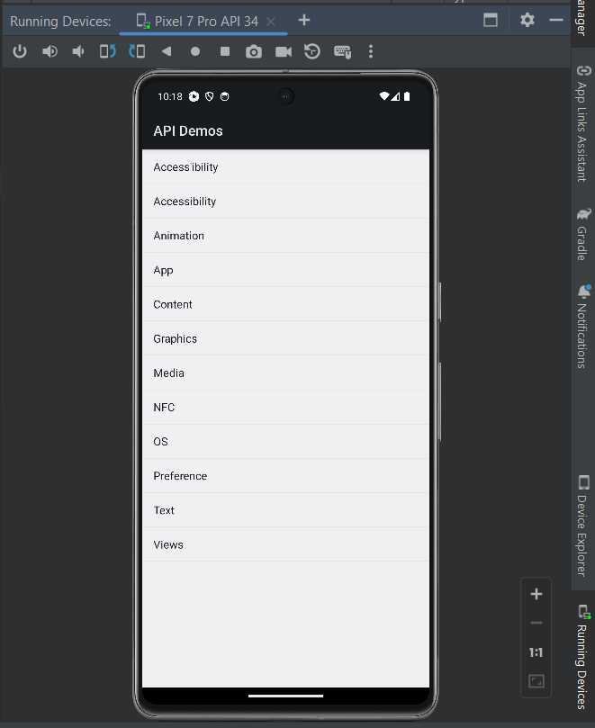
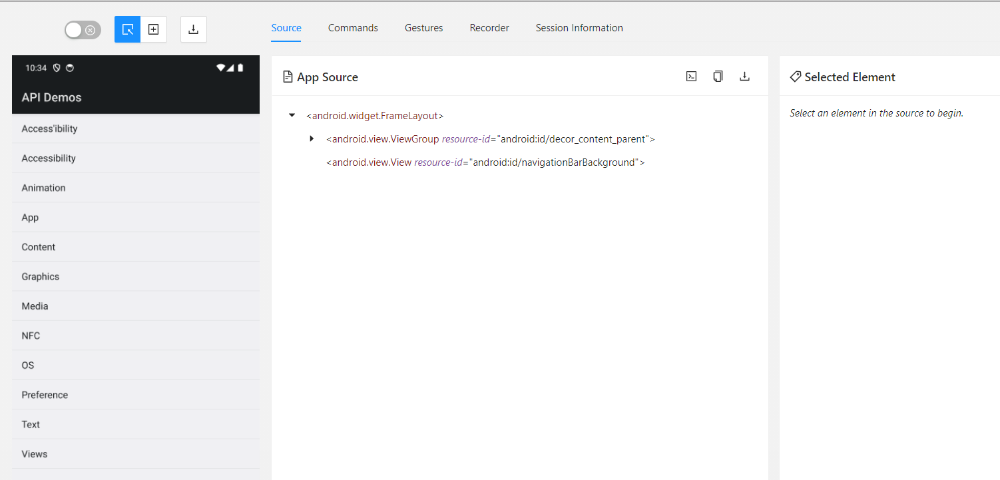

# STARTING LECTURES DEPENDENCIES

We'll start with the following versions:

- Android Studio 2023.1.1.28
- Appium 2.4.1
- Java-Client 9.1.0
- TestNG 7.9.0
- Maven Archetype template 1.4

We **won't include selenium dependencies** as of now in the project, these packages will be installed later. So, the current POM.xml should be like this:

```xml
  <dependencies>
    <dependency>
      <groupId>io.appium</groupId>
      <artifactId>java-client</artifactId>
      <version>9.1.0</version>
      <scope>test</scope>
    </dependency>
    <dependency>
      <groupId>org.testng</groupId>
      <artifactId>testng</artifactId>
      <version>7.9.0</version>
      <scope>test</scope>
    </dependency>
  </dependencies>
```

(Note: selenium 4.17.2 was installed and then uninstalled from python, to check that the latest version is 4.17.2)

### Warning about versions

**Java client** has many **compatibility issues** among its versions 7, 8 and 9 with Java 8 and 11 and the different versions of selenium, aswell of some deprecated items.

To see the compatibility matrix, go to:

https://github.com/appium/java-client/blob/master/README.md

Some useful info about UIAutomator 2 can be found here too:

https://github.com/appium/appium-uiautomator2-driver/blob/master/README.md


# ADD COURSE'S APP TO PROJECT

The first app we'll use is the **myDemo.apk**. To place it into our Eclipse's project, we'll follow these steps:

1. Right-click on <u>src/test/java</u>
2. New -> Package
3. Name the package: in this case, we'll name it resources'
4. Click on finish
5. Go to windows explorer and copy <u>myDemo.apk</u> file
6. Click on the <u>resources</u> package and paste the app with Ctrl + V.


# UIAUTOMATOR2

UIAutomator was designed by Google to facilitate automation. Appium took this tool and came up with UIAutomator2, a modified version of the original framework.

### Check for Appium installed drivers

1. In powershell, paste:

   ```bash
   appium driver list
   ```

   The original list returned should be:

   Listing available drivers:
   - uiautomator2 [not installed]
   - xcuitest [not installed]
   - mac2 [not installed]
   - espresso [not installed]
   - safari [not installed]
   - gecko [not installed]
   - chromium [not installed]

### Install UIAutomator

1. In powershell, paste:

   ```bash
   appium driver install uiautomator2
   ```

2. Paste previous command (check for installed drivers) to verify if uiautomator2 was succesfully installed.

   In our case, we installed uiautomator2 version **2.44.0**


# ECLIPSE + UIAUTOMATOR2

### TESTNG Basic class

1. Open Eclipse project
2. Right-click <u>alex.appium.project0</u> under <u>src/test/java</u>.
3. Create new class 'appiumBasics'

The simplest form of TestNG is:

```java
package alex.appium.project0;

import org.testng.annotations.Test;

public class appiumBasics {
	@Test
	public void myAppiumTest() {
		// Code to be executed
	}
}
```

We'll run this test as testng test, not as a java app anymore, so the shortcut will be:

​					Run as TestNG test

----------------------------   **ALT SHIFT X, N**   ----------------------------


### Android Object

> CREATE ANDROID OBJECT (TO START APP)

1. **Prelim step: Open Appium server** via Powershell.

   ```bash
   appium
   ```

2. **Import needed packages:**

   ```java
   import org.testng.annotations.Test;
   import io.appium.java_client.android.AndroidDriver;
   import java.net.URL;
   import java.net.MalformedURLException;
   import io.appium.java_client.android.options.UiAutomator2Options;
   ```

   Here's the function of all of them:

   `org.testng.annotations.Test` :  identifies the method as a test case to be executed in testing.

   `io.appium.java_client.android.AndroidDriver` : allows to create Android object.

   `java.net.URL` : allows to introduce Android-object's  IP and port.

   `java.net.MalformedURLException` : allows to introduce URL.

   `io.appium.java_client.android.options.UiAutomator2Options` : allows to configure Android-object's capabilities.

3. **Create Android Object:**

   We need to tell Appium which driver we'll use. For this, we'll create an object of an Android driver class. This object needs two arguments (which appear as null at first):

   - Appium Service

   - Capabilities

   ```java
   AndroidDriver myDriver = new AndroidDriver(null,null);
   ```

4. **First argument: Appium Service**

   By default, server opens on port 4723 of our local IP address (notice that we can't directly put the string, but he have to create a 'URL' class.).

   ```java
   AndroidDriver myDriver = new AndroidDriver(new URL("http://127.0.0.1:4723"), null);
   ```

5. **Second argument: Capabilites (create UiAutomator object)** 

   Capabilities refer to which operating system and particular device the test will take place, aswell as to which app we'll automate. To specify capabilities, we'll create an object of UiAutomator class.

   ```java
   UiAutomator2Options myOptions = new UiAutomator2Options();
   ```

   After that, we'll set the device with `.setDeviceName()` and `.setApp()` methods.

   ```java
   myOptions.setDeviceName("Pixel 7 Pro API 34");
   myOptions.setApp("C://Users//Diego//eclipse-workspace//project0//src//test//java//resources//myDemo.apk");
   ```

   *IMPORTANT*

   - The **device name must match with the one** we chose when creating our AVD **in Android Studio**.
   - The **app path** can be found by right-clicking on <u>myDemo.apk</u> (inside src/test/java -> alex.appium.project0 -> resources), clicking on 'propierties' and then copying the location.


> CLOSE APP (UIAUTOMATOR SESSION)

We use `.quit()` method to disconnect the driver (UIAutomator2) from Appium server.

```java
myDriver.quit();
```


##### 1st runnable test

At this point, we can execute our first test:

1. Open AS, run AVD
2. Open Appium server via powershell
3. Open Eclipse, run the code below as 'TestNG Test'

The whole picture up until now looks like this. When run, it will install the <u>myDemo.apk</u> app to our AVD.

```java
package alex.appium.project0;

import org.testng.annotations.Test;
import io.appium.java_client.android.AndroidDriver;
import io.appium.java_client.android.options.UiAutomator2Options;
import java.net.URL;
import java.net.MalformedURLException;

public class appiumBasics {
    @Test
    public void myAppiumTest() throws MalformedURLException {
        UiAutomator2Options myOptions = new UiAutomator2Options();
        myOptions.setDeviceName("Pixel 7 Pro API 34");
        myOptions.setApp("C://Users//Diego//eclipse-workspace//project0//src//test//java//resources//myDemo.apk");

        AndroidDriver myDriver = new AndroidDriver(new URL("http://127.0.0.1:4723"), myOptions);
        
        myDriver.quit();
    }
}
```

And it's a success!



#### First ever logs

In powershell, we can see everything appium did when we ran the test in eclipse. Some important logs are these:

- **Login and environment config:**
  - <u>[Appium]</u> AppiumDriver.createSession() -> New appium session
  - <u>[Appium]</u> Event 'newSessionRequested' logged -> New session request
  - <u>[Appium]</u> Attempting to find matching driver -> Looks for proper driver (UIAutomator in this case)
  - <u>[Appium]</u> Session created with session id -> shows the session's id
  - <u>[BaseDriver]</u> Using local app 'C://Users//Diego//eclipse-workspace/...' -> app to be tested
- **Connection with device:**
  - <u>[UIAutomator2]</u> Retrieving device list -> Looks for connected devices
  - <u>[ADB]</u> Connected devices: [{"ud...  -> Connected device (an emulator, in this case)
  - <u>[UIAutomator2]</u> Using device: emulator-5554 -> Confirms the device
- **Obtaining device info:**
  - [<u>ADB]</u> Current device property 'ro.build.version.sdk': 34 -> Device's SDK Version
  - <u>[ADB]</u> Current device property 'ro.build.version.release': 14 -> Operating system (android) version
- **Configuring Appium apk:**
  - <u>[UIAutomator2]</u> Pushing settings apk to the device... -> Appium's config app installation into the device
  - <u>[ADB]</u> The installation of 'settings_apk-debug.apk' took 197ms -> Installation time
- **Starting UiAutomator2 server:**
  - <u>[ADB]</u> Forwarding system: 8200 to device: 6790 -> Sends AVD's 6790 port to local's 8200 port for UIAutomator communication
- **App's certificates verification:**
  - <u>[ADB]</u> Checking app cert for C://...myDemo.apk -> Validates app-to-be-tested's certificates
- **Application installation:**
  - <u>[ADB]</u> Installing 'C://...myDemo.apk' -> Installing app to be testes
- **UIAutomator2 server startup:**
  - <u>[UIAutomator2]</u> Starting UIAutomator2 server 6.0.7 -> UIAutomator 6.0.7 starts
- **Creating automation session:**
  - [UIAutomator2] Matched '/session' to command name 'createSession'
- **Deleting session:**
  - **[UIAutomator2]** Matched '/' to command name 'deleteSession'

- **Instrumentation:**
  - <u>[Instrumentation]</u> Time: 64.207 -> Test time
    <u>[Instrumentation]</u> OK (1 test)
    <u>[Instrumentation]</u> The process has exited with code 0


Glossary:

ADB (Android Debug Bridge)


### Start/Close Appium server with object (not via powershell)

> SERVER OBJECT

 Using the code above as a starting point, Appium server can be started with an object of `AppiumServiceBuilder()` class.

```java
AppiumServiceBuilder myService = new AppiumServiceBuilder();
```


> SERVER OBJECT PARAMETERS

Then, we use `.withAppiumJS()` method to reference the object towards <u>main.js</u>, which is the file that invokes appium server. 

```java
myService.withAppiumJS(new File("C://Users//Diego//AppData//Roaming//npm//node_modules//appium//build//lib//main.js"));
```

And then again, we use `.withIPAdress()` method to reference the object to our IP.

```java
myService.withIPAddress("http://127.0.0.1");
```

And `.usingPort()` method for our port.

```java
myService.usingPort(4723);
```


Notice how we also needed to create an object of 'File' class, and we didn't simply put the path as a String in  `.withAppiumJS()` method, but we did straightforward wrote the IP as a string in `.withIPAdress()` method, and that's because **every method tell us which data-type they need when we hover the cursor above them**.

NOTE: Java doesn't accept single slashes (/) in paths, they have to be double slashes (//).


> SERVER BUILD AND START

After setting up the object with the described methods above, we have to create a new object of `AppiumDriverLocalService` class and make use of `.buildService()` and `.start()` methods **to start the server**.

```java
AppiumDriverLocalService myServer = AppiumDriverLocalService.buildService(myService);
myServer.start();
```

The new packages added are:

```java
import java.io.File;
import io.appium.java_client.service.local.AppiumServiceBuilder;
import io.appium.java_client.service.local.AppiumDriverLocalService;
```


> CLOSE THE SERVER

We use `.quit()` method to close the service.

```java
myServer.close();
```


##### 2nd runnable test

At this point, we only need to:

1. Open Eclipse and run the code below as 'TestNG Test'.

(No need of using powershell)

When run, it will open <u>myDemo.apk</u> app in our AVD.

The whole picture now is:

```java
package alex.appium.project0;

import org.testng.annotations.Test;
import io.appium.java_client.android.AndroidDriver;
import io.appium.java_client.android.options.UiAutomator2Options;
import java.net.URL;
import java.net.MalformedURLException;
import java.io.File;
import io.appium.java_client.service.local.AppiumServiceBuilder;
import io.appium.java_client.service.local.AppiumDriverLocalService;

public class appiumBasics {
	@Test
	public void myAppiumTest() throws MalformedURLException {
		
        // ECLIPSE CODE -> APPIUM SERVER -> ANDROID STUDIO
		// Appium server config
		AppiumServiceBuilder myService = new AppiumServiceBuilder();
		myService.withAppiumJS(new File("C://Users//Diego//AppData//Roaming//npm//node_modules//appium//build//lib//main.js"));
		myService.withIPAddress("127.0.0.1");
		myService.usingPort(4723);
		
		// Apium server startup
		AppiumDriverLocalService myServer = AppiumDriverLocalService.buildService(myService);
        myServer.start();

        // Android object Capabilities (device and app specs)
		UiAutomator2Options myOptions = new UiAutomator2Options();
		myOptions.setDeviceName("Pixel 7 Pro API 34");
        myOptions.setApp("C://Users//Diego//eclipse-workspace//project0//src//test//java//resources//myDemo.apk");
		
        // Android object and app (session) startup
		AndroidDriver myDriver = new AndroidDriver(new URL("http://127.0.0.1:4723"), myOptions);
		
        // Actual automation goes here...
        
		// App (session) closing and UIAutomator2 disconnection
		myDriver.quit();
		
		// Appium server closing
		myServer.stop();
	}
}
```

Now the logs will be shown in Eclipse's console.

NOTE: Also, the app gets stored and available in the AVD.

With this, we've finished the part of 'One time effort'. Next, comes the automation.


<u>Success!</u>


# APPIUM INSPECTOR

**To select (click) an item of an app, we need to know its properties**, so we can define the type of locator we should use (Xpath, id, accessibilityId, classname or androidUIAutomator). To this purpose, there is <u>Appium inspector</u>.

Appium inspector is a cross-platform tool, it works for both android and ¡os.

### Installation

1. Go to the releases page: https://github.com/appium/appium-inspector/releases
2. Download .exe from assets. In this case, we're downloading <u>Inspector version 2023.12.2</u>
3. Install

### Config

Similar to the config needed to send our eclipse code to the emulator, inspector also needs info to know which emulator and which screen we want to scan for properties.


1. Open Inspector
2. **Host and port:**
   - Host: 127.0.0.1
   - Port: 4723
3. **Desired capabilities:** Introduce the following (use '+' button to add more fields).

<table style="width: 100%; text-align: center; vertical-align: middle; border-collapse: collapse;">
    <thead>
        <tr>
            <th width="50%">Name</th>
            <th width="50%">Value</th>
        </tr>
    </thead>
    <tbody>
        <tr>
            <td>app</td>
            <td>C://Users//Diego//eclipse-workspace//project0//src//test//java//resources//myDemo.apk
            </td>
        </tr>
        <tr>
            <td>deviceName</td>
            <td>Pixel 7 Pro API 34
            </td>
        </tr>
        <tr>
            <td>platformName</td>
            <td>android
            </td>
        </tr>
        <tr>
            <td>automationName</td>
            <td>UIAutomator2
            </td>
        </tr>
    </tbody>
</table>

   We'll get this JSON representation at the right:

```json
{
  "app": "C://Users//Diego//eclipse-workspace//project0//src//test//java//resources//myDemo.apk",
  "deviceName": "Pixel 7 Pro API 34",
  "platformName": "android",
  "automationName": "UIAutomator2"
}
```

3. Start appium via powershell
4. Open Android studio and run AVD
5. Click on <u>Start Session</u>

We should see this:



### Inspect elements

Let's assume we want the propierties of 'Preference'. Then,

1. Click on 'Preference'
2. Copy one of the selector values of the <u>Find By</u> table in the <u>Selected element</u> tab.


# ECLIPSE + INSPECTOR

While having our three apps open (Eclipse, Inspector and Android Studio), we can start <u>Actual Automation</u> using `.FindElement()` method.

**NOTE** There's a 'catch' here:

- <u>By.</u> is generic (web and mobile; it comes from selenium)
- <u>AppiumBy.</u> is exclusive for appium (mobile)

So, we have to make a clarification with the use of locators:

<table style="width: 100%; text-align: center; vertical-align: middle; border-collapse: collapse;">
    <thead>
        <tr>
            <th width="50%">Locator</th>
            <th width="50%">Can be used by</th>
        </tr>
    </thead>
    <tbody>
        <tr>
            <td>Xpath<br>
                id<br>
                classname
            </td>
            <td>appium, selenium (By.)
            </td>
        </tr>
        <tr>
            <td>accessibilityId<br>
                androidUIAutomator
            </td>
            <td>appium only (AppiumBy.)
            </td>
        </tr>
    </tbody>
</table>


### Click on an element

In this example, we wanna click on 'Preference' via accessibilityId. So we use `.click` method.

Notice how we need to <u>find the element and click on it in the same line of code</u>.

- **Correct form** Find-and-click

```java
myDriver.findElement(AppiumBy.accessibilityId("Preference")).click();
```

- **Incorrect form** Find-then-click

```java
myDriver.findElement(AppiumBy.accessibilityId("Preference"));
myDriver.click();
```

(this carries `import io.appium.java_client.AppiumBy;`)

##### 3rd runnable test

When run (Alt Shift X, N), it will open <u>myDemo.apk</u> app in our AVD and click on 'Preferences'.

<u>Success!</u>

**NOTE**

There's no need to close the Inspector session to run the test.


# BASE CLASS

There are pieces of our **code** that are **common to all** our appium **tests**. In our case, all code enclosed between these comments are a <u>must for our tests</u>, since they configure the server and the AVD

```java
        // ECLIPSE CODE -> APPIUM SERVER -> ANDROID STUDIO
		// Appium server config
		// Apium server startup
        // Android object Capabilities (device and app specs)
        // Android object and app (session) startup
```

and also the code enclosed here:

```java
		// App (session) closing and UIAutomator2 disconnection
		// Appium server closing
```


> CREATE A BASE CLASS

To create a base class, we can follow the steps described here: [Create a class](#TESTNG-Basic-class).

All **reusable utilities go into the Base class** (we named it <u>BaseTest.java</u>).

So, we'll create two methods: `setUp()` and `teardown()` which will configure-and-open and close the server, respectively.

**NOTE**

To avoid the '<x> cannot be resolved' error, we must ensure that 'myDriver' and 'myServer' objects are **public**, so they can be accessed from multiple classes. (This is not the correct access modifier, but this will be discused later.)

```java
public class BaseTest {
	
	public AndroidDriver myDriver;
	public AppiumDriverLocalService myServer;
    // setUp...
    // tearDown...
```


Our base class will look like this:

```java
package alex.appium.project0;

import java.io.File;
import java.net.MalformedURLException;
import java.net.URL;

import io.appium.java_client.android.AndroidDriver;
import io.appium.java_client.android.options.UiAutomator2Options;
import io.appium.java_client.service.local.AppiumDriverLocalService;
import io.appium.java_client.service.local.AppiumServiceBuilder;

public class BaseTest {
	
	public AndroidDriver myDriver;
	public AppiumDriverLocalService myServer;
	
	public void setUp() throws MalformedURLException {
        // ECLIPSE CODE -> APPIUM SERVER -> ANDROID STUDIO
		// Appium server config
		AppiumServiceBuilder myService = new AppiumServiceBuilder();
		myService.withAppiumJS(new File("C://Users//Diego//AppData//Roaming//npm//node_modules//appium//build//lib//main.js"));
		myService.withIPAddress("127.0.0.1");
		myService.usingPort(4723);
		
		// Apium server startup
		AppiumDriverLocalService myServer = AppiumDriverLocalService.buildService(myService);
        myServer.start();

        // Android object Capabilities (device and app specs)
		UiAutomator2Options myOptions = new UiAutomator2Options();
		myOptions.setDeviceName("Pixel 7 Pro API 34");
        myOptions.setApp("C://Users//Diego//eclipse-workspace//project0//src//test//java//resources//myDemo.apk");
		
        // Android object and app (session) startup
		AndroidDriver myDriver = new AndroidDriver(new URL("http://127.0.0.1:4723"), myOptions);
	}
	
	public void tearDown() {
		// App (session) closing and UIAutomator2 disconnection
		myDriver.quit();
		
		// Appium server closing
		myServer.stop();
	}

}

```


### Inheritance applied to setUp & tearDowm

> AUTOMATIONTEST EXTENDS BASETEST

Back to our automation file (appiumBasics), we need our class to have the attributes and methods of BaseTest, which are:

- Attributes:
  -  myDriver
  - myServer
- Methods:
  - setUp()
  - tearDown()

so, **we'll apply inheritance**, in this way:

```java
public class appiumBasics extends BaseTest{
```

However, we can't run our file at this point, because we haven't called the setUp and tearDown() methods yet. If we do, we'll get the 'NullPointerException' error.


So, we'll **call the methods** this way:

```java
	public void myWifiSettingsTest() throws MalformedURLException {
		// Start server
		setUp();
        // Automation...
        // Close server
        tearDown();
```

And the resulting code is:

```java
package alex.appium.project0;

import org.testng.annotations.Test;
import java.net.MalformedURLException;
import io.appium.java_client.AppiumBy;


public class appiumBasics extends BaseTest{
	@Test
	public void myWifiSettingsTest() throws MalformedURLException {
		// Start server
		setUp();
		
        // Actual automation goes here...
		myDriver.findElement(AppiumBy.accessibilityId("Preference")).click();
        
		// Close server
		tearDown();
	}
}
```


### TestNG further simplification: before and after class

We've simplified our automation file by applying inheritance, but we can simplify it even further using TestNG.

So, we'll head to BaseTest and add:

```java
@BeforeClass
```

which carries this package: `import org.testng.annotations.BeforeClass;`

`@BeforeClass` is an annotation that marks a method that must be executed once before all the other test methods.


This implies that **we no longer need to call setUp method** in our <u>AppiumBasics</u>, because TestNG automatically searchs for a @BeforeClass in <u>BaseTest</u>.

And, if you hadn't noticed (I hadn't XD), we've always had a @Test in AppiumBasics.

```java
public class appiumBasics extends BaseTest{
	@Test
	public void myWifiSettingsTest(){
    //...
```


Similarly, we can do the same to close the server, using `@AfterClass`, which comes with `import org.testng.annotations.AfterClass;`.


##### 4th runnable test

Let's see our resulting Automation and BaseTest.

**Appium Basics** (runnable)

When run (Alt Shift X, N), it will open <u>myDemo.apk</u> app in our AVD and click on 'Preferences'.

<u>Success!</u>

```java
package alex.appium.project0;

import org.testng.annotations.Test;
import java.net.MalformedURLException;
import io.appium.java_client.AppiumBy;


public class appiumBasics extends BaseTest{
	@Test
	public void myWifiSettingsTest() throws MalformedURLException {
        // Automation goes here...
		myDriver.findElement(AppiumBy.accessibilityId("Preference")).click();
        
	}
}
```

**BaseTest**

```java
package alex.appium.project0;

import java.io.File;
import java.net.MalformedURLException;
import java.net.URL;

import io.appium.java_client.android.AndroidDriver;
import io.appium.java_client.android.options.UiAutomator2Options;
import io.appium.java_client.service.local.AppiumDriverLocalService;
import io.appium.java_client.service.local.AppiumServiceBuilder;

import org.testng.annotations.AfterClass;
import org.testng.annotations.BeforeClass;

public class BaseTest {
	
	public AndroidDriver myDriver;
	public AppiumDriverLocalService myServer;
	
	@BeforeClass
	public void setUp() throws MalformedURLException {
        // ECLIPSE CODE -> APPIUM SERVER -> ANDROID STUDIO
		// Appium server config
		AppiumServiceBuilder myService = new AppiumServiceBuilder();
		myService.withAppiumJS(new File("C://Users//Diego//AppData//Roaming//npm//node_modules//appium//build//lib//main.js"));
		myService.withIPAddress("127.0.0.1");
		myService.usingPort(4723);
		
		// Apium server startup
		AppiumDriverLocalService myServer = AppiumDriverLocalService.buildService(myService);
        myServer.start();

        // Android object Capabilities (device and app specs)
		UiAutomator2Options myOptions = new UiAutomator2Options();
		myOptions.setDeviceName("Pixel 7 Pro API 34");
        myOptions.setApp("C://Users//Diego//eclipse-workspace//project0//src//test//java//resources//myDemo.apk");
		
        // Android object and app (session) startup
		AndroidDriver myDriver = new AndroidDriver(new URL("http://127.0.0.1:4723"), myOptions);
	}
	
	@AfterClass
	public void tearDown() {
		// App (session) closing and UIAutomator2 disconnection
		myDriver.quit();
		
		// Appium server closing
		myServer.stop();
	}

}

```


, Child appium tests